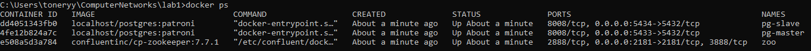
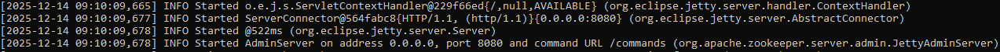
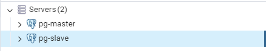
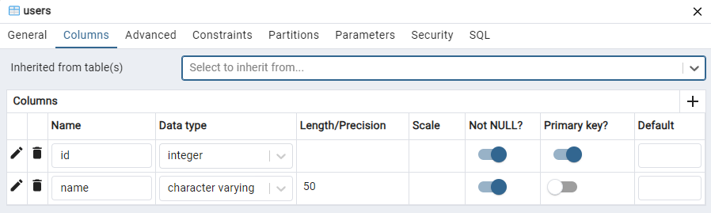
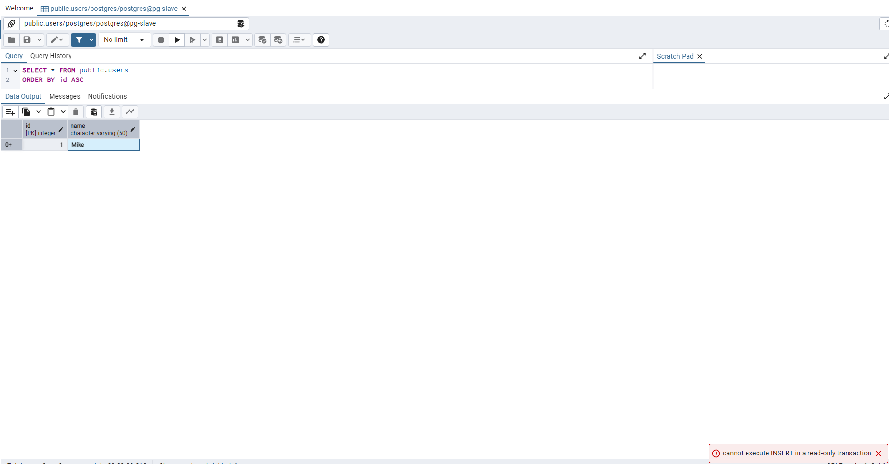
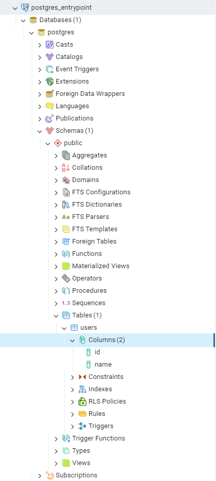

# ЛР 1. HA Postgres Cluster. Команда 21
## Задача
Развернуть и настроить высокодоступный кластер Postgres

## Часть 1. Поднимаем Postgres

Подготавливаем Dockerfile для нашего постгреса. Кластеризацию будем делать с помощью Patroni, а ему необходим доступ к бинарникам
самого постгреса. Поэтому будем билдить образ, который сразу содержит в себе Postgres + Patroni

## dockerfile
```dockerfile
FROM postgres:15
# Ставим нужные для Patroni зависимости
RUN apt-get update -y && \
 apt-get install -y netcat-openbsd python3-pip curl python3-psycopg2 python3-venv iputils-ping
# Используем виртуальное окружение, доустанавливаем, собственно, Patroni
RUN python3 -m venv /opt/patroni-venv && \
 /opt/patroni-venv/bin/pip install --upgrade pip && \
 /opt/patroni-venv/bin/pip install patroni[zookeeper] psycopg2-binary
# Копируем конфигурацию для двух узлов кластера Patroni
COPY postgres0.yml /postgres0.yml
COPY postgres1.yml /postgres1.yml
ENV PATH="/opt/patroni-venv/bin:$PATH"
USER postgres
#CMD не задаем, т.к. все равно будем переопределять его далее в compose
```
Подготавливаем compose файл, в котором описываем наш деплой постгреса. Так же добавляем в него Zookepeer, который нужен для
непосредственного управления репликацией и определением “лидера” кластера

## docker-compose.yml
```yml
services:
  pg-master:
    build: .
    image: localhost/postgres:patroni # имя для кастомного образа из Dockerfile, можно задать любое
    container_name: pg-master # Будущий адрес первой ноды
    restart: always
    hostname: pg-master
    environment:
      POSTGRES_USER: postgres
      POSTGRES_PASSWORD: postgres
      PGDATA: '/var/lib/postgresql/data/pgdata'
    expose:
      - 8008
    ports:
      - 5433:5432
    volumes:
      - pg-master:/var/lib/postgresql/data
    command: patroni /postgres0.yml
  pg-slave:
    build: .
    image: localhost/postgres:patroni # имя для кастомного образа из Dockerfile, можно задать любое
    container_name: pg-slave # Будущий адрес второй ноды
    restart: always
    hostname: pg-slave
    expose:
      - 8008
    ports:
      - 5434:5432
    volumes:
      - pg-slave:/var/lib/postgresql/data
    environment:
      POSTGRES_USER: postgres
      POSTGRES_PASSWORD: postgres
      PGDATA: '/var/lib/postgresql/data/pgdata'
    command: patroni /postgres1.yml
  zoo:
    image: confluentinc/cp-zookeeper:7.7.1
    container_name: zoo # Будущий адрес зукипера
    restart: always
    hostname: zoo
    ports:
      - 2181:2181
    environment:
      ZOOKEEPER_CLIENT_PORT: 2181
      ZOOKEEPER_TICK_TIME: 2000

volumes:
  pg-master:
  pg-slave:

```

Создаем упомянутые выше postgres0.yml и затем на основе него — postgres1.yml (надо будешь лишь поменять имя, адреса и место хранения
данных ноды с первой на вторую)
## postgres0.yml:
```yml
scope: my_cluster
name: postgresql0
restapi:
  listen: pg-master:8008
  connect_address: pg-master:8008
zookeeper:
  hosts:
    - zoo:2181
bootstrap:
  dcs:
    ttl: 30
    loop_wait: 10
    retry_timeout: 10
    maximum_lag_on_failover: 10485760
    master_start_timeout: 300
    synchronous_mode: true
    postgresql:
      use_pg_rewind: true
      use_slots: true
      parameters:
        wal_level: replica
        hot_standby: "on"
        wal_keep_segments: 8
        max_wal_senders: 10
        max_replication_slots: 10
        wal_log_hints: "on"
        archive_mode: "always"
        archive_timeout: 1800s
        archive_command: mkdir -p /tmp/wal_archive && test ! -f /tmp/wal_archive/%f && cp %p /tmp/wal_archive/%f
  pg_hba:
    - host replication replicator 0.0.0.0/0 md5
    - host all all 0.0.0.0/0 md5
postgresql:
  listen: 0.0.0.0:5432
  connect_address: pg-master:5432
  data_dir: /var/lib/postgresql/data/postgresql0
  bin_dir: /usr/lib/postgresql/15/bin
  pgpass: /tmp/pgpass0
  authentication:
    replication:
      username: replicator
      password: rep-pass
    superuser:
      username: postgres
      password: postgres
    parameters:
      unix_socket_directories: '.'
watchdog:
  mode: off
tags:
  nofailover: false
  noloadbalance: false
  clonefrom: false
  nosync: false
```
## postgres1.yml:
```yml
scope: my_cluster
name: postgresql1
restapi:
  listen: pg-slave:8008
  connect_address: pg-slave:8008
zookeeper:
  hosts:
    - zoo:2181
bootstrap:
  dcs:
    ttl: 30
    loop_wait: 10
    retry_timeout: 10
    maximum_lag_on_failover: 10485760
    master_start_timeout: 300
    synchronous_mode: true
    postgresql:
      use_pg_rewind: true
      use_slots: true
      parameters:
        wal_level: replica
        hot_standby: "on"
        wal_keep_segments: 8
        max_wal_senders: 10
        max_replication_slots: 10
        wal_log_hints: "on"
        archive_mode: "always"
        archive_timeout: 1800s
        archive_command: mkdir -p /tmp/wal_archive && test ! -f /tmp/wal_archive/%f && cp %p /tmp/wal_archive/%f
  pg_hba:
    - host replication replicator 0.0.0.0/0 md5
    - host all all 0.0.0.0/0 md5
postgresql:
  listen: 0.0.0.0:5432
  connect_address: pg-slave:5432
  data_dir: /var/lib/postgresql/data/postgresql1
  bin_dir: /usr/lib/postgresql/15/bin
  pgpass: /tmp/pgpass0
  authentication:
    replication:
      username: replicator
      password: rep-pass
    superuser:
      username: postgres
      password: postgres
    parameters:
      unix_socket_directories: '.'
watchdog:
  mode: off
tags:
  nofailover: false
  noloadbalance: false
  clonefrom: false
  nosync: false
```

Деплоим с помощью команды

```bash
docker-compose up -d --build
```

Посмотрим логи zookeeper

Посмотрим логи pg-master


## Часть 2. Проверяем репликацию

Подключаемся к обеим нодам постгреса.



Создадим таблицу users в pg-master



Видим, что она продублировалась в pg-slave


При попытке добавить данные в таблицу получаем отказ, т.к. эта нода работает в режиме slave/readonly



## Часть 3. Делаем высокую доступность

Для балансировки трафика нам нужен специальное ПО, собственно балансировщик. Например, HAProxy — добавляем его в docker-compose.yml

## docker-compose.yml
```yml
  haproxy:
    image: haproxy:3.0
    container_name: postgres_entrypoint
    ports:
      - 5431:5432
      - 7000:7000
    depends_on:
      - pg-master
      - pg-slave
      - zoo
    volumes:
      - ./haproxy.cfg:/usr/local/etc/haproxy/haproxy.cfg
```
Не забываем создать упомянутый выше haproxy.cfg
## haproxy.cfg
```
global
    maxconn 100
defaults
    log global
    mode tcp
    retries 3
    timeout client 30m
    timeout connect 4s
    timeout server 30m
    timeout check 5s
listen stats
    mode http
    bind *:7000
    stats enable
    stats uri /
listen postgres
    bind *:5432
    option httpchk
    http-check expect status 200
    default-server inter 3s fall 3 rise 2 on-marked-down shutdown-sessions
    server postgresql_pg_master_5432 pg-master:5432 maxconn 100 check port 8008
    server postgresql_pg_slave_5432 pg-slave:5432 maxconn 100 check port 8008

```
Перезапускаем проект. И проверяем, что всё корректно поднялось.


Подключаемся к “новой” базе данных, в качестве адреса используя имя контейнера с HAProxy



Выключаем доступ до ноды, которая сейчас является мастером


Попытаемся считать/записать что-то в БД через entrypoint подключение


Зайдём в pg-slave и посмотрим, получил ли он данные, которые
были записаны


### Ответы на вопросы 
1. Порты 8008 и 5432 вынесены в разные директивы, expose и ports. По сути, если записать 8008 в ports, то он тоже станет exposed. В
чем разница?
>  Директива ports открывает порты для доступа извне контейнера, в то время как expose делает порт доступным только внутри Docker-сети, для других контейнеров

2. При обычном перезапуске композ-проекта, будет ли сбилден заново образ? А если предварительно отредактировать файлы
postgresX.yml? А если содержимое самого Dockerfile? Почему?
> Если не используется флаг --build, образ не будет пересобран. Основной принцип работы Docker — образы неизменяемы. Пересборка без необходимости потратит время и ресурсы
